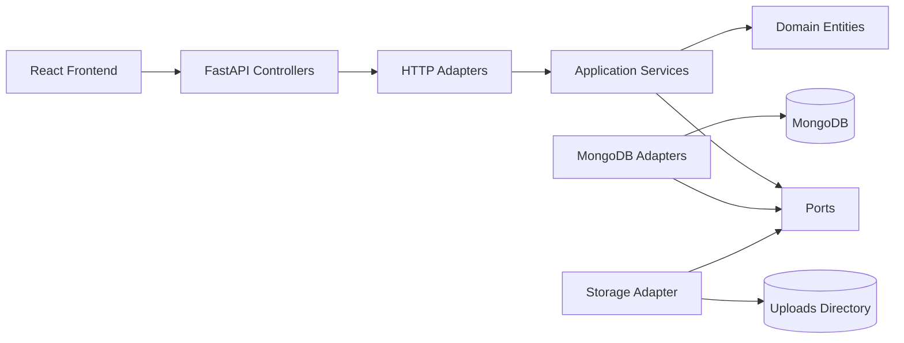

# Архітектура

## Огляд
Проєкт реалізує **hexagonal architecture** для платформи оголошень з модерацією, повідомленнями, категоріями, авторизацією та завантаженням зображень.

Система поділена на такі рівні:
- `domain` — чисті доменні сутності та enum-типи
- `application` — бізнес-сценарії, порти та прикладні помилки
- `adapters` — реалізації портів для HTTP, MongoDB, локального файлового сховища та security
- `controllers` — FastAPI router-и, які публікують application use cases як REST API
- `frontend` — React/Vite клієнт для marketplace UI

## Правило залежностей
Залежності спрямовані **ззовні всередину**:
- HTTP та persistence залежать від `application`
- `application` залежить тільки від `domain` і контрактів-портів
- `domain` не залежить ні від FastAPI, ні від MongoDB, ні від React

## Composition root
Головна точка збирання системи:
- [src/main.py](</e:/архітПЗ/l3/src/main.py>)
- [src/adapters/http/dependencies.py](</e:/архітПЗ/l3/src/adapters/http/dependencies.py>)

Саме тут:
- створюється `FastAPI`-застосунок;
- налаштовуються middleware, CORS, lifecycle hooks;
- підключаються router-и;
- збираються application services з конкретними Mongo/file/security адаптерами.

## Backend-шари

### 1. Domain
Основні сутності:
- `User`
- `Category`
- `Listing`
- `ListingImage`
- `Message`
- `Role`
- `ListingStatus`

Файл:
- [src/domain/entities.py](</e:/архітПЗ/l3/src/domain/entities.py>)

### 2. Application
Містить:
- application services
- порти
- типізовані помилки

Основні сервіси:
- `AuthApplicationService`
- `UserApplicationService`
- `CategoryApplicationService`
- `ListingApplicationService`
- `ModerationApplicationService`
- `MessageApplicationService`
- `UploadApplicationService`

Файли:
- [src/application/services](</e:/архітПЗ/l3/src/application/services>)
- [src/application/ports](</e:/архітПЗ/l3/src/application/ports>)
- [src/application/common/errors.py](</e:/архітПЗ/l3/src/application/common/errors.py>)

### 3. Adapters
HTTP/security:
- [src/adapters/http/security.py](</e:/архітПЗ/l3/src/adapters/http/security.py>)
- [src/adapters/http/errors.py](</e:/архітПЗ/l3/src/adapters/http/errors.py>)
- [src/adapters/http/dependencies.py](</e:/архітПЗ/l3/src/adapters/http/dependencies.py>)

Persistence:
- [src/adapters/persistence/mongodb/repositories.py](</e:/архітПЗ/l3/src/adapters/persistence/mongodb/repositories.py>)

Storage:
- [src/adapters/storage/local_files.py](</e:/архітПЗ/l3/src/adapters/storage/local_files.py>)

### 4. Controllers
Router-и FastAPI:
- [src/controllers/auth.py](</e:/архітПЗ/l3/src/controllers/auth.py>)
- [src/controllers/categories.py](</e:/архітПЗ/l3/src/controllers/categories.py>)
- [src/controllers/listings.py](</e:/архітПЗ/l3/src/controllers/listings.py>)
- [src/controllers/messages.py](</e:/архітПЗ/l3/src/controllers/messages.py>)
- [src/controllers/moderation.py](</e:/архітПЗ/l3/src/controllers/moderation.py>)
- [src/controllers/uploads.py](</e:/архітПЗ/l3/src/controllers/uploads.py>)
- [src/controllers/users.py](</e:/архітПЗ/l3/src/controllers/users.py>)

## Persistence model
Проєкт використовує MongoDB, але зберігає **числові `id`**, щоб не ламати контракт frontend/API.

Ключові колекції:
- `users`
- `categories`
- `listings`
- `listing_images`
- `messages`
- `counters`

Файл:
- [src/db/database.py](</e:/архітПЗ/l3/src/db/database.py>)

## Frontend
Frontend побудований на:
- React 19
- React Router
- Vite
- централізованому API client у [frontend/src/lib/api.ts](</e:/архітПЗ/l3/frontend/src/lib/api.ts>)

Поточний UI стилізований під marketplace dashboard і працює на тих же бекенд-ендпойнтах без зміни логіки.

## Діаграми
Детальні UML-діаграми знаходяться тут:
- [docs/spec/system-documentation.md](</e:/архітПЗ/l3/docs/spec/system-documentation.md>)
- [docs/diagrams/class-diagram.mmd](</e:/архітПЗ/l3/docs/diagrams/class-diagram.mmd>)
- [docs/diagrams/use-case-diagram.mmd](</e:/архітПЗ/l3/docs/diagrams/use-case-diagram.mmd>)
- [docs/diagrams/component-diagram.mmd](</e:/архітПЗ/l3/docs/diagrams/component-diagram.mmd>)
- [docs/diagrams/sequence-auth-login.mmd](</e:/архітПЗ/l3/docs/diagrams/sequence-auth-login.mmd>)
- [docs/diagrams/sequence-listing-moderation.mmd](</e:/архітПЗ/l3/docs/diagrams/sequence-listing-moderation.mmd>)
- [docs/diagrams/deployment-diagram.mmd](</e:/архітПЗ/l3/docs/diagrams/deployment-diagram.mmd>)
