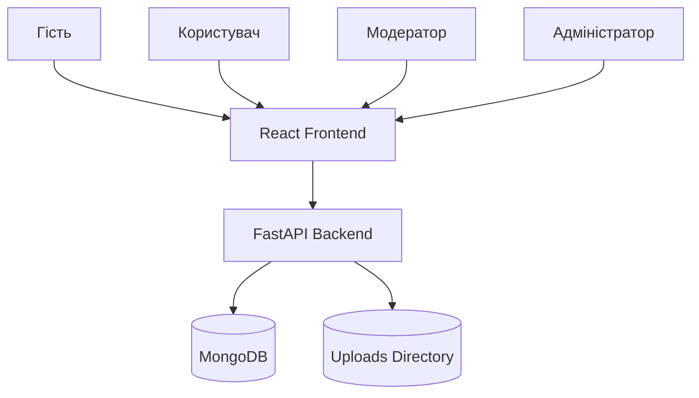
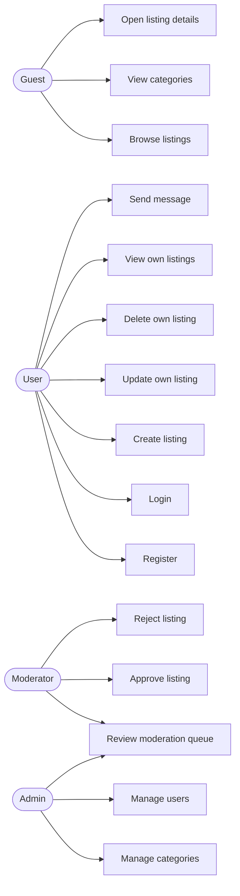
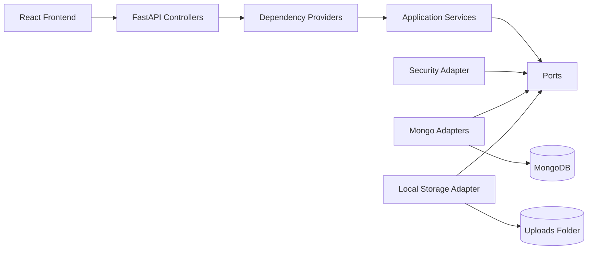
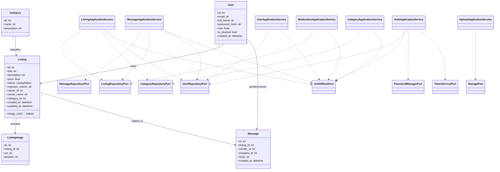
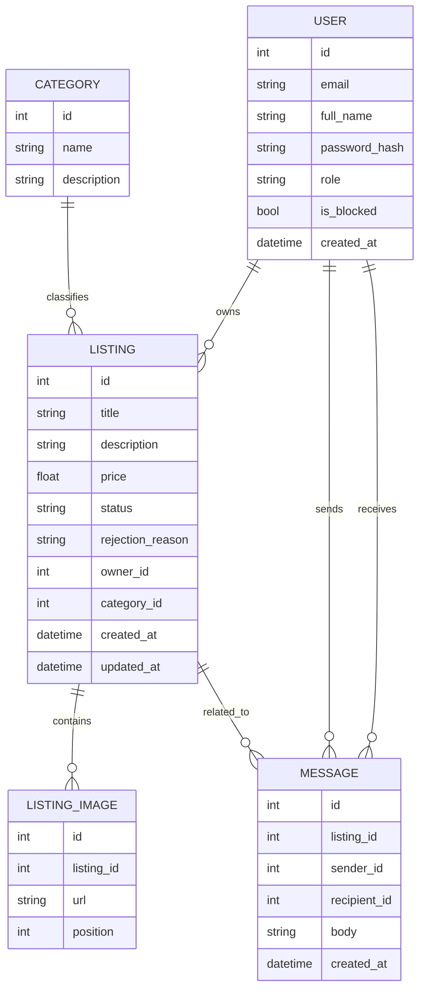
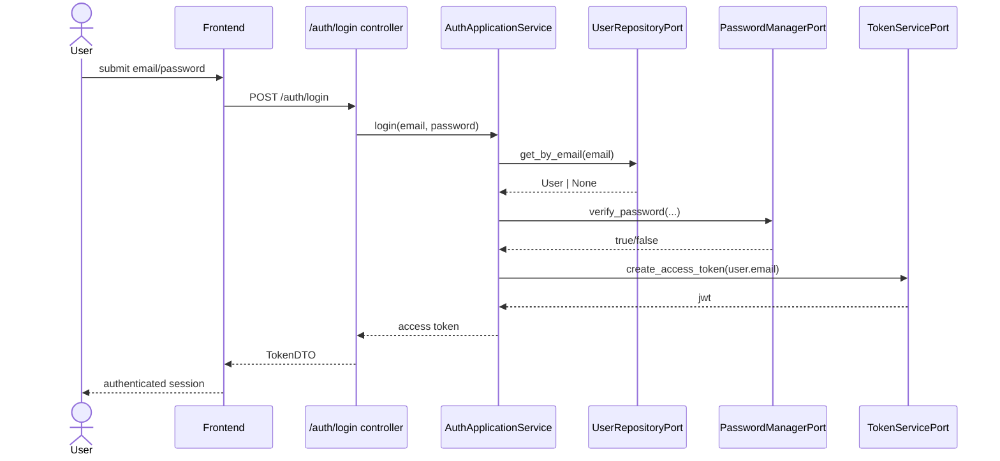
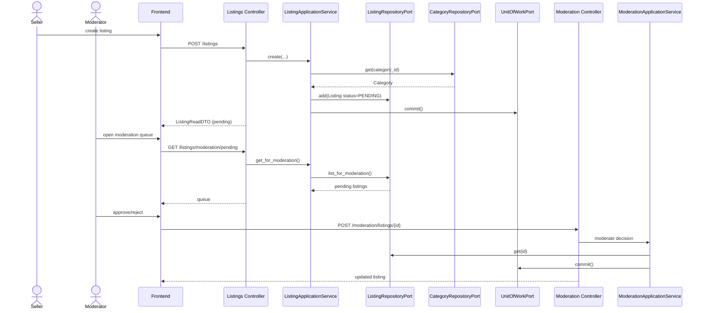
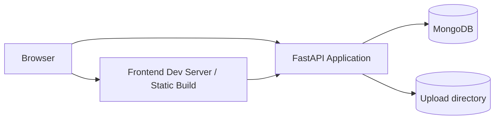

# Повна системна документація

## 1. Призначення системи
`Bulletin Board Platform` — це вебплатформа для публікації та перегляду оголошень, модерації контенту, обміну повідомленнями між користувачами та керування категоріями.

Система підтримує:
- публічний каталог оголошень;
- реєстрацію та вхід користувачів;
- ролі `user`, `moderator`, `admin`;
- створення та редагування оголошень;
- чергу модерації;
- внутрішні повідомлення;
- завантаження зображень;
- frontend marketplace/dashboard UI;
- REST API з OpenAPI/Swagger.

## 2. Бізнес-цілі
- надати користувачу зрозумілий каталог оголошень;
- відокремити бізнес-логіку від HTTP та persistence;
- забезпечити контрольований moderation workflow;
- підтримувати розширення без ламання зовнішнього API;
- зберегти тестованість через порти та ізоляцію домену.

## 3. Технологічний стек

### Backend
- Python 3.11+
- FastAPI
- Pydantic
- PyMongo
- python-jose
- MongoDB

### Frontend
- React 19
- React Router
- Vite
- TypeScript

### Testing
- pytest
- mongomock

## 4. Контекст системи



## 5. Основні ролі

### Гість
- перегляд каталогу;
- перегляд окремого оголошення;
- перегляд категорій;
- перегляд публічної частини frontend.

### Користувач
- реєстрація;
- вхід;
- створення оголошення;
- редагування власних оголошень;
- видалення власних оголошень;
- перегляд своїх оголошень;
- повідомлення іншим користувачам.

### Модератор
- перегляд черги модерації;
- схвалення оголошень;
- відхилення оголошень з причиною.

### Адміністратор
- усе, що може модератор;
- керування категоріями;
- керування користувачами.

## 6. Use case diagram



Сирець:
- [docs/diagrams/use-case-diagram.mmd](</e:/архітПЗ/l3/docs/diagrams/use-case-diagram.mmd>)

## 7. Архітектурний стиль
Проєкт використовує **hexagonal architecture**.

### Внутрішнє ядро
- `domain`
- `application`

### Зовнішні адаптери
- HTTP controllers/adapters
- MongoDB persistence adapters
- file storage adapter
- JWT/password adapters

### Правило
Зовнішні технології не повинні протікати в application/domain.

## 8. Компонентна діаграма



Сирець:
- [docs/diagrams/component-diagram.mmd](</e:/архітПЗ/l3/docs/diagrams/component-diagram.mmd>)

## 9. Структура каталогів

```text
src/
  adapters/
    http/
    persistence/mongodb/
    storage/
  application/
    common/
    ports/
    services/
  controllers/
  core/
  db/
  domain/
  dto/
  models/
  repositories/
frontend/
  src/
docs/
  diagrams/
  spec/
tests/
```

## 10. Опис рівнів

### 10.1 Domain layer
Файл:
- [src/domain/entities.py](</e:/архітПЗ/l3/src/domain/entities.py>)

Сутності:
- `User`
- `Category`
- `Listing`
- `ListingImage`
- `Message`

Enum-и:
- `Role`
- `ListingStatus`

Особливості:
- `Listing.image_urls` формується як property на основі `Listing.images`;
- сутності не містять FastAPI/Pydantic/Mongo-залежностей;
- часи створення задаються через `utc_now()`.

### 10.2 Application layer
Файли:
- [src/application/services](</e:/архітПЗ/l3/src/application/services>)
- [src/application/ports](</e:/архітПЗ/l3/src/application/ports>)

Сервіси:
- `AuthApplicationService`
- `UserApplicationService`
- `CategoryApplicationService`
- `ListingApplicationService`
- `ModerationApplicationService`
- `MessageApplicationService`
- `UploadApplicationService`

Прикладні помилки:
- `ValidationError`
- `UnauthorizedError`
- `ForbiddenError`
- `NotFoundError`
- `ConflictError`

### 10.3 Adapters
HTTP:
- DTO-конверсія;
- security dependencies;
- exception mapping.

MongoDB:
- реалізація repository ports;
- unit of work;
- адаптація до існуючого `DatabaseSession`.

Storage:
- локальне збереження зображень;
- повернення URL для frontend/backend.

### 10.4 Controllers
Кожен controller:
- отримує DTO;
- викликає application service;
- повертає DTO-відповідь;
- використовує dependency injection для сервісів та auth.

## 11. Class diagram



Сирець:
- [docs/diagrams/class-diagram.mmd](</e:/архітПЗ/l3/docs/diagrams/class-diagram.mmd>)

## 12. Порти системи

### Repository ports
Файл:
- [src/application/ports/repositories.py](</e:/архітПЗ/l3/src/application/ports/repositories.py>)

Порти:
- `UnitOfWorkPort`
- `UserRepositoryPort`
- `CategoryRepositoryPort`
- `ListingRepositoryPort`
- `MessageRepositoryPort`

### Security ports
Файл:
- [src/application/ports/security.py](</e:/архітПЗ/l3/src/application/ports/security.py>)

Порти:
- `PasswordManagerPort`
- `TokenServicePort`

### Storage port
Файл:
- [src/application/ports/storage.py](</e:/архітПЗ/l3/src/application/ports/storage.py>)

Порт:
- `StoragePort`

## 13. Application services детально

### 13.1 AuthApplicationService
Файл:
- [src/application/services/auth.py](</e:/архітПЗ/l3/src/application/services/auth.py>)

Відповідальність:
- реєстрація користувача;
- перевірка дубліката email;
- хешування пароля;
- логін;
- перевірка блокування;
- видача JWT.

### 13.2 ListingApplicationService
Файл:
- [src/application/services/listings.py](</e:/архітПЗ/l3/src/application/services/listings.py>)

Відповідальність:
- створення оголошення;
- редагування;
- повторний відправлення в статус `pending` після редагування;
- видача публічного каталогу;
- видача власних оголошень;
- видача черги модерації;
- видалення власного оголошення.

### 13.3 ModerationApplicationService
Відповідальність:
- схвалення `pending` оголошення;
- відхилення з причиною;
- зміна статусів.

### 13.4 MessageApplicationService
Відповідальність:
- створення повідомлення;
- вибірка inbox користувача;
- контроль доступу до повідомлень.

### 13.5 CategoryApplicationService
Відповідальність:
- CRUD категорій;
- перевірки дублювання назви;
- перевірка пов’язаного контенту перед видаленням.

### 13.6 UserApplicationService
Відповідальність:
- профіль поточного користувача;
- адміністрування користувачів;
- блокування/оновлення ролей.

### 13.7 UploadApplicationService
Відповідальність:
- збереження зображень;
- повернення доступних URL;
- інкапсуляція storage-логіки.

## 14. HTTP API

### Auth
- `POST /auth/register`
- `POST /auth/login`

### Users
- `GET /users/me`
- `PATCH /users/me`
- `GET /users`
- `GET /users/{user_id}`
- `PATCH /users/{user_id}`
- `DELETE /users/{user_id}`

### Categories
- `POST /categories`
- `GET /categories`
- `GET /categories/{category_id}`
- `PUT /categories/{category_id}`
- `DELETE /categories/{category_id}`

### Listings
- `POST /listings`
- `PUT /listings/{listing_id}`
- `GET /listings`
- `GET /listings/{listing_id}`
- `GET /listings/me/owned`
- `GET /listings/moderation/pending`
- `DELETE /listings/{listing_id}`

### Moderation
- `POST /moderation/listings/{listing_id}`

### Messages
- `POST /messages`
- `GET /messages/me`
- `GET /messages/{message_id}`
- `DELETE /messages/{message_id}`

### Uploads
- `POST /uploads/images`

### Health
- `GET /health`

Докладніше:
- [docs/spec/api.md](</e:/архітПЗ/l3/docs/spec/api.md>)

## 15. DTO-контракти
Файл:
- [src/dto/schemas.py](</e:/архітПЗ/l3/src/dto/schemas.py>)

Основні DTO:
- `UserCreateDTO`, `UserLoginDTO`, `UserReadDTO`
- `CategoryCreateDTO`, `CategoryReadDTO`
- `ListingCreateDTO`, `ListingUpdateDTO`, `ListingReadDTO`
- `ModerationDecisionDTO`
- `MessageCreateDTO`, `MessageReadDTO`
- `UploadImageBatchDTO`

## 16. База даних

### Колекції
- `users`
- `categories`
- `listings`
- `listing_images`
- `messages`
- `counters`

### Відповідність сутностей колекціям
- `User -> users`
- `Category -> categories`
- `Listing -> listings`
- `ListingImage -> listing_images`
- `Message -> messages`

### Індекси
- `users.email` — unique
- `categories.name` — unique
- `listings(status, created_at)`
- `listing_images(listing_id, position)`
- `messages(listing_id, created_at)`

## 17. ER / data relation view



## 18. Security model

### Аутентифікація
- Bearer JWT
- `Authorization: Bearer <token>`
- JWT створюється через `TokenServiceAdapter`

### Хешування паролів
- PBKDF2-HMAC SHA-256
- випадкова `salt`
- порівняння через `hmac.compare_digest`

### Авторизація
- рольові перевірки через `require_role(...)`
- доступ до moderation тільки для `admin` / `moderator`
- доступ до власних оголошень тільки власнику
- доступ до повідомлень тільки учасникам діалогу

Файл:
- [src/adapters/http/security.py](</e:/архітПЗ/l3/src/adapters/http/security.py>)

## 19. Основні сценарії (sequence diagrams)

### 19.1 Логін



Сирець:
- [docs/diagrams/sequence-auth-login.mmd](</e:/архітПЗ/l3/docs/diagrams/sequence-auth-login.mmd>)

### 19.2 Публікація та модерація оголошення



Сирець:
- [docs/diagrams/sequence-listing-moderation.mmd](</e:/архітПЗ/l3/docs/diagrams/sequence-listing-moderation.mmd>)

## 20. Frontend architecture

### Основні сторінки
- `HomePage`
- `CatalogPage`
- `ListingDetailPage`
- `WorkspacePage`
- `ErrorPage`

### Основні компоненти UI
- `Header`
- `HeroPanel`
- `HeroSearch`
- `ListingCard`
- `CategorySection`
- `StatsBar`
- `FeatureStrip`
- `ModeratorDashboard`
- `MessagesPanel`
- `AuthPanel`
- `WorkspacePanels`

### Дані frontend
Frontend не дублює бізнес-логіку бекенда, а використовує:
- `api.ts` для HTTP-запитів;
- локальний state в `App.tsx`;
- route-based navigation;
- DTO/TypeScript interfaces з [frontend/src/lib/types.ts](</e:/архітПЗ/l3/frontend/src/lib/types.ts>).

## 21. Workflow frontend ↔ backend
- login/register через `/auth/*`;
- каталог через `/listings` і `/categories`;
- listing detail через `/listings/{id}`;
- moderation dashboard через `/listings/moderation/pending` та `/moderation/listings/{id}`;
- messages через `/messages`;
- uploads через `/uploads/images`.

## 22. Запуск системи

### Backend
```powershell
py -m pip install -e .[dev]
Copy-Item .env.example .env
uvicorn src.main:app --reload
```

### Frontend
```powershell
cd frontend
npm install
npm run dev
```

### Unified start
```powershell
.\run.ps1
```

## 23. Deployment view



Сирець:
- [docs/diagrams/deployment-diagram.mmd](</e:/архітПЗ/l3/docs/diagrams/deployment-diagram.mmd>)

## 24. Тестування

Покриття:
- unit tests для application/domain/persistence сценаріїв;
- integration tests для REST API;
- frontend build verification.

Основні команди:
```powershell
pytest
ruff check src tests
cd frontend
npm run build
```

## 25. Сильні сторони поточної реалізації
- hexagonal separation уже закладена;
- application layer не прив’язаний до FastAPI controller logic;
- persistence та security інкапсульовані адаптерами;
- frontend використовує існуючий API без дублювання бізнес-логіки;
- збережено сумісність із числовими `id`.

## 26. Технічні компроміси
- Mongo adapter наразі спирається на внутрішній `DatabaseSession` та repository-wrapper шар;
- у кодовій базі ще присутні legacy каталоги `models`, `repositories`, `services`, але активний потік проходить через `application` + `adapters`;
- частина UML описує цільову архітектурну модель, а не legacy-модулі, які лишилися для сумісності.

## 27. Рекомендовані напрями розвитку
- винести frontend state management у окремий store при зростанні складності;
- додати refresh token flow;
- додати audit trail модерації;
- винести file storage в S3-compatible adapter;
- додати повноцінний search index для великого каталогу;
- покрити frontend компонентними тестами.

## 28. Перелік ключових файлів
- [src/main.py](</e:/архітПЗ/l3/src/main.py>)
- [src/domain/entities.py](</e:/архітПЗ/l3/src/domain/entities.py>)
- [src/application/ports/repositories.py](</e:/архітПЗ/l3/src/application/ports/repositories.py>)
- [src/application/services/auth.py](</e:/архітПЗ/l3/src/application/services/auth.py>)
- [src/application/services/listings.py](</e:/архітПЗ/l3/src/application/services/listings.py>)
- [src/adapters/http/security.py](</e:/архітПЗ/l3/src/adapters/http/security.py>)
- [src/adapters/persistence/mongodb/repositories.py](</e:/архітПЗ/l3/src/adapters/persistence/mongodb/repositories.py>)
- [src/db/database.py](</e:/архітПЗ/l3/src/db/database.py>)
- [frontend/src/App.tsx](</e:/архітПЗ/l3/frontend/src/App.tsx>)
- [frontend/src/lib/api.ts](</e:/архітПЗ/l3/frontend/src/lib/api.ts>)
- [frontend/src/styles.css](</e:/архітПЗ/l3/frontend/src/styles.css>)
